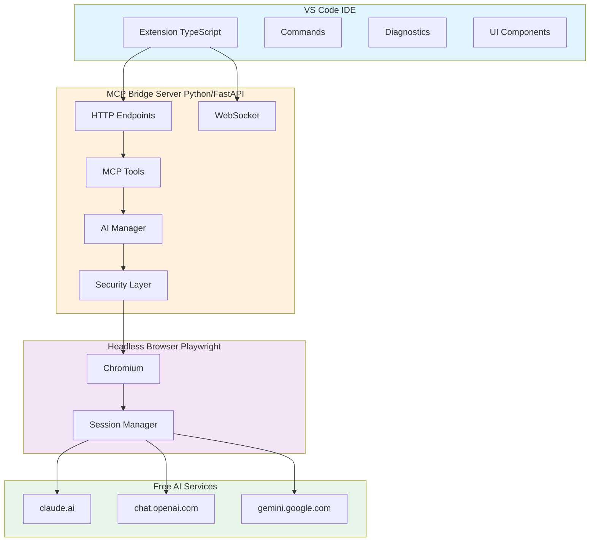
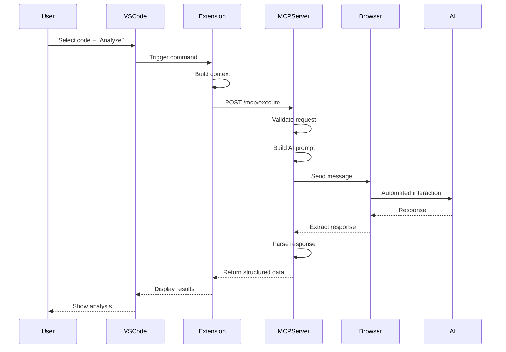
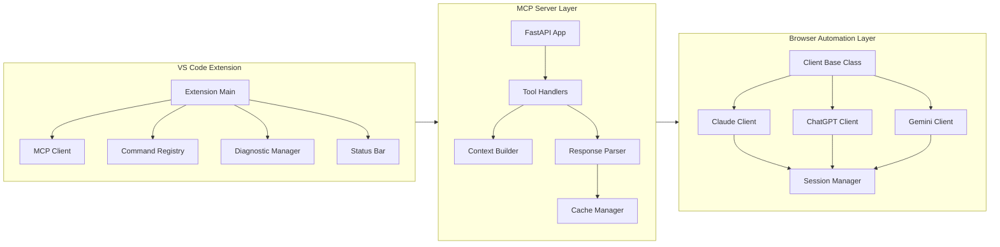
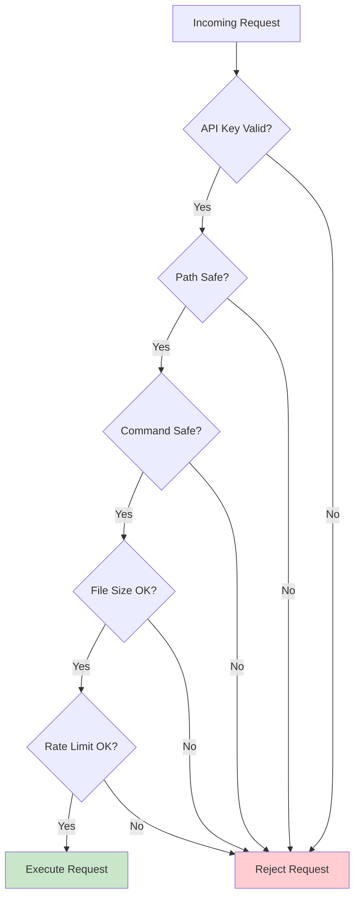
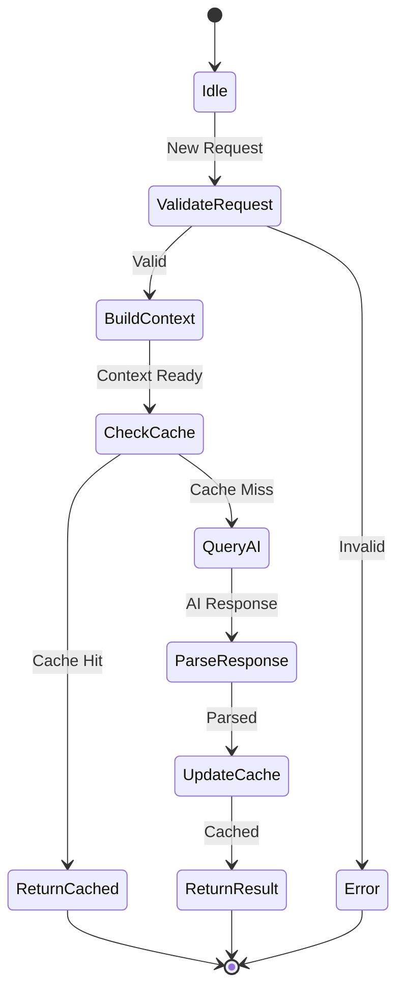
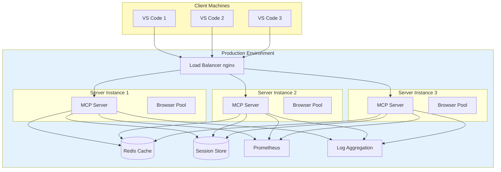
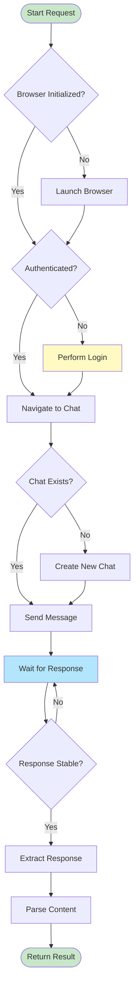
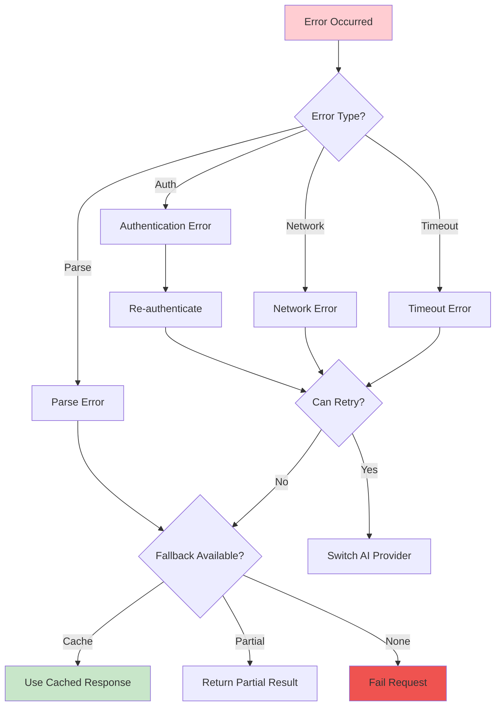
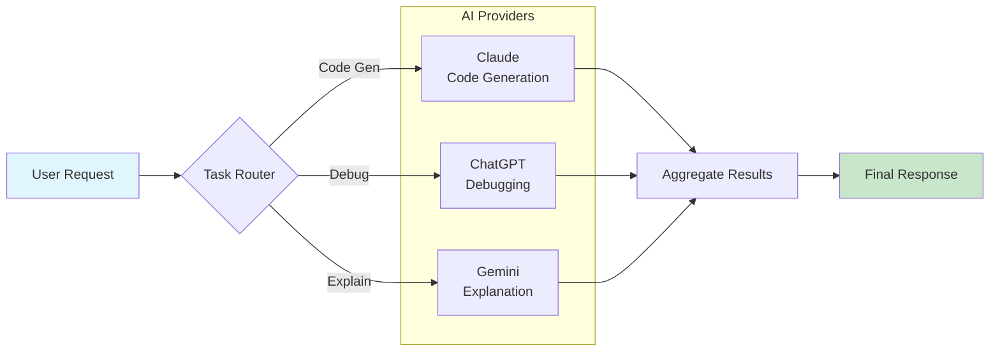

# AI-IDE Integration - Visual Architecture Diagrams

## System Architecture (Mermaid)



## Data Flow Diagram



## Component Architecture



## Security Architecture



## Request Processing Flow



## Deployment Architecture



## Browser Automation Flow



## Error Handling Flow



## Multi-Provider Strategy



---

## ASCII Diagrams (for terminals/plain text)

### Simple Architecture
```
┌──────────────┐
│   VS Code    │
│  Extension   │
└──────┬───────┘
       │ HTTP
       ▼
┌──────────────┐
│ MCP Server   │
│  (Python)    │
└──────┬───────┘
       │ Playwright
       ▼
┌──────────────┐
│   Browser    │
│  Automation  │
└──────┬───────┘
       │
       ▼
┌──────────────┐
│  claude.ai   │
│ chatgpt.com  │
└──────────────┘
```

### Data Flow
```
User → VS Code → Extension → MCP Server → Browser → AI Service
                                ↓
                           File System
                           ↓
                        Workspace Files
```

### Component Layers
```
┌─────────────────────────────────────────┐
│         Presentation Layer              │
│  (VS Code Extension, UI Components)     │
└─────────────────────────────────────────┘
┌─────────────────────────────────────────┐
│         Business Logic Layer            │
│   (MCP Tools, Context Builder, etc.)    │
└─────────────────────────────────────────┘
┌─────────────────────────────────────────┐
│       Integration Layer                 │
│   (Browser Automation, AI Clients)      │
└─────────────────────────────────────────┘
┌─────────────────────────────────────────┐
│         External Services               │
│    (Claude, ChatGPT, Gemini)            │
└─────────────────────────────────────────┘
```

---

These diagrams can be rendered in:
- GitHub/GitLab README
- Confluence
- VS Code (with Mermaid extension)
- Documentation sites (MkDocs, Sphinx, etc.)
