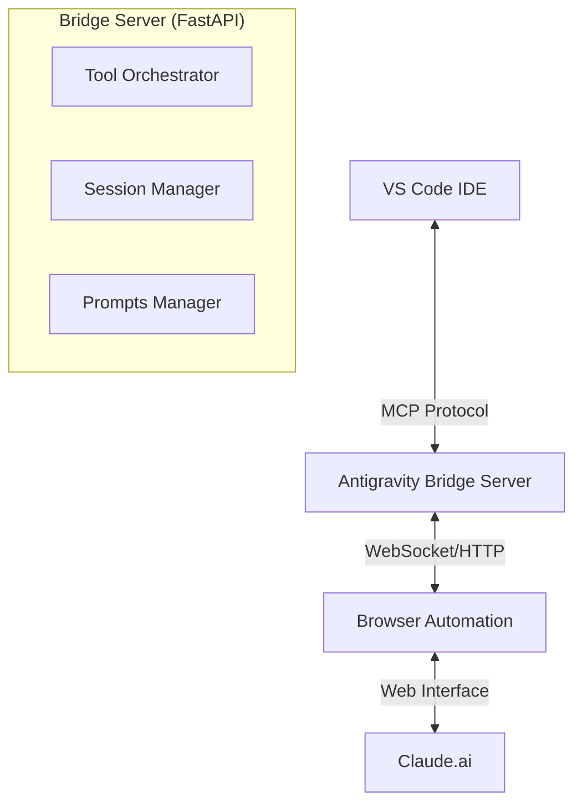

# 🛸 Antigravity: Professional AI IDE Bridge

**Antigravity** is a high-performance, autonomous AI IDE agent that transforms VS Code into a professional-grade development powerhouse. By bridging your local workspace with the sophisticated reasoning of Claude.ai via a resilient browser automation layer, Antigravity provides a seamless agentic experience with zero API costs.

---

## 💎 Features at a Glance

### 🛰️ Resilient Infrastructure
- **Dynamic Selector Logic**: Decoupled `selectors.json` configuration with multi-path fallbacks ensures the bridge never breaks when the Claude UI updates.
- **WebSocket Streaming**: Real-time token streaming gives you instant feedback as the AI "types" in your IDE.
- **Background Refresh**: Integrated heartbeat loop keeps your browser session alive 24/7.
- **Stop Generation**: Native control to abort AI tasks instantly from the IDE status bar.

### 🧠 Advanced Agentic Tools
- **Deep Code Analysis**: AST-based `view_file_outline` to grok complex projects without blowing the context window.
- **Surgical Edits**: High-precision `replace_file_content` for exact-string matching and code modification.
- **Synchronized Chat**: 2-way visual parity between VS Code and the browser. Actions in one are mirrored in the other.
- **Workspace Search**: Integrated `grep_search` (ripgrep) for workspace-wide symbol and text discovery.

### 🎨 Customizable Intelligence
- **Per-Language Prompts**: Context-aware behavior for **Python** (Odoo, PEP 8), **Dart/Flutter** (Riverpod, Material 3), and **TypeScript**.
- **Visual Dashboard**: Real-time server monitoring at `http://localhost:8000/`.

---

## 🏗️ Architecture



---

## 🚀 Installation & Setup

### 1. Backend: AI IDE Bridge
```bash
# Navigate to bridge directory
cd ai-ide-bridge

# Create environment
python -m venv venv
.\venv\Scripts\activate

# Install dependencies
pip install fastapi uvicorn playwright pydantic

# Initialize browser
playwright install chromium
```

### 2. Frontend: VS Code Extension
- Open the codebase in VS Code.
- Navigate to `vscode-ai-assistant`.
- Run `npm install` and `npm run compile`.
- Press `F5` to start debugging.

### 3. Launching
```bash
# Start the bridge server
python mcp_server/server.py
```
*Wait for the "✓ Server ready!" message, then open VS Code to start agentic development.*

---

## 🛠️ Usage

1. **Dashboard**: Open `http://localhost:8000` to see active chat IDs and workspace status.
2. **Commands**: Use `Ctrl+Shift+P` and type `Antigravity` to see available agent tools.
3. **Agent Loop**: Use the `agent_task` tool for complex, multi-step autonomous assignments.

---

## 🛡️ Security
- **Path Guarding**: All file operations are restricted to the validated `workspace_root`.
- **Command Blacklisting**: Dangerous shell commands are blocked by default.
- **Explicit Review**: All tool executions are logged and visible in the server console.

---

## 📄 License
MIT License. Created with ❤️ for developers who demand premium AI assistance.
